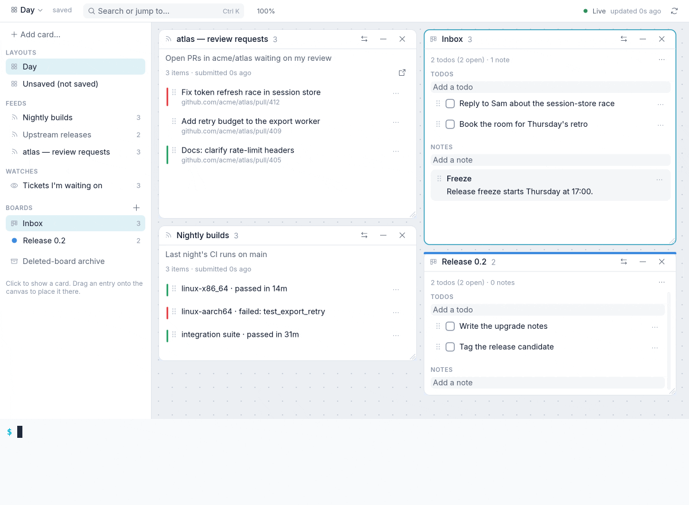

<div align="center">

# callboard

**A bulletin board for your scripts, todos, and notes, on your Linux desktop.**

Scripts post what they find. callboard tracks what's new, and keeps it on a canvas beside your boards.

[](LICENSE)
[](https://www.rust-lang.org/)
[](#quick-start)

[Quick start](#quick-start) · [How it works](#how-it-works) · [Command line](docs/cli.md) · [Desktop app](docs/gui.md) · [Design](DESIGN.md) · [Development](docs/development.md)

</div>

<picture>
  <source media="(prefers-color-scheme: dark)" srcset="docs/assets/demo-dark.gif">
  
</picture>

Anything a script can fetch can be a feed: pull requests waiting on you, last
night's builds, new releases of the tools you pin. Each run submits the whole
list, and callboard works out what changed. Beside the feeds you keep boards of
todos and notes, and the desktop app lays them all out as cards you arrange
and save.

- **Feeds from any script.** Pipe a JSON list to `callboard put` and callboard
  diffs it against the last run: new and updated items are marked, removed ones
  remembered, and an exit code tells your scheduler when something arrived.
- **Boards for the rest.** Todos and notes, with colors, archives, and promotion
  from any feed item in one drag.
- **A canvas you arrange.** Cards overlap, resize, and collapse; layouts save
  automatically, and Ctrl+K finds any feed, board, or layout.
- **Live everywhere.** Every write reaches every open window at once, from the
  CLI, a script, or another window.
- **Private to your account.** A per-user service on a Unix socket checks each
  peer's UID with the kernel. There is no network listener.
- **Upgrades in place.** `callboard upgrade` moves the running service onto a new
  build without a restart or a dropped request.

## Quick start

Requires Linux and Rust 1.98 or newer; the desktop app also needs Wayland or X11
with OpenGL.

```sh
git clone https://github.com/RagingRedRiot/callboard.git
cd callboard
cargo install --path crates/callboard --locked
cargo install --path crates/callboard-gui --locked
```

Post a feed and open the board:

```sh
printf '%s' '[{"key":"pr-42","title":"Fix auth race","url":"https://github.com/org/repo/pull/42"}]' \
  | callboard put reviews --title "Review requests" --new-for 24h
callboard board add Inbox
callboard todo add Inbox "Reply about the migration"
callboard-gui
```

The service starts on demand and keeps running after the window closes. To start
it at login instead, run `callboard setup` (a systemd user unit).

## How it works

A small service owns a SQLite store under `~/.local/share/callboard` and serves
a JSON API on a private Unix socket. The CLI, your scripts, and the desktop app
are all clients of it, and the app follows a stream of change events, so what
you see is always current.

A feed is identified by name and replaced as a whole on each submission. A
tracking script is usually a fetch piped into `put`:

```sh
gh search prs --review-requested=@me --state open --json url,title \
    --jq 'map({key: .url, title, url})' \
  | callboard put reviews --title "Review requests" --stale-after 1h --exit-added 10
```

`--exit-added 10` exits with 10 when new items arrived, so a scheduler such as
[cued](https://github.com/RagingRedRiot/cued) can notify you only then. If the
fetch fails, `callboard fail reviews "message"` marks the feed without touching
its items.

## Documentation

| | |
|---|---|
| [Command line](docs/cli.md) | Feeds, snapshot format, boards and items, layouts, the service, upgrade and uninstall |
| [Desktop app](docs/gui.md) | The canvas, cards, live updates, and saved layouts |
| [Design](DESIGN.md) | Concepts, API, events, security model, and lifecycle |
| [Development](docs/development.md) | Building, tests, local checks, and the [merge gate](docs/merge-checks.md) |

## Upgrade and uninstall

```sh
git pull && cargo install --path crates/callboard --locked && cargo install --path crates/callboard-gui --locked
callboard upgrade            # switch the running service to the new build
callboard uninstall          # remove the service, unit, and all data (--purge for config too)
```

## Status

callboard is alpha software. The API and storage may
change between versions; `callboard upgrade` migrates your data in place. MCP
access for AI assistants is designed (DESIGN.md §9.3) but not implemented yet.

## License

[MIT](LICENSE)
