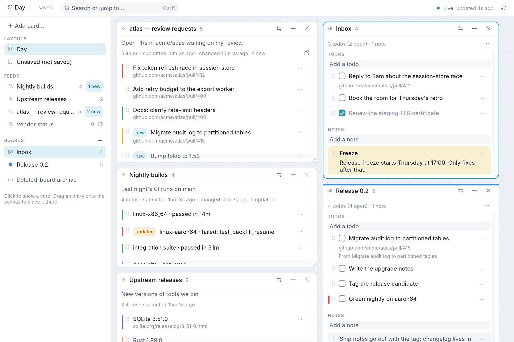

# Desktop app

<picture>
  <source media="(prefers-color-scheme: dark)" srcset="assets/canvas-dark.png">
  
</picture>

## Starting

The desktop app lists feeds and boards and displays their
contents, feed errors/staleness, snoozed items, and source-reference status.
The GUI starts `callboard serve` on demand when it cannot connect, then leaves
the service running if the window closes. It locates the service executable as
`callboard` beside the GUI binary or on `PATH`. Set `CALLBOARD_EXECUTABLE` to a
specific executable path to override lookup. For example, during development:

```sh
cargo build -p callboard
target/debug/callboard-gui
```

`callboard-gui --install-desktop` adds Callboard to your desktop's applications
list, with its icon in the dock. It writes `callboard.desktop` to
`$XDG_DATA_HOME/applications` (default `~/.local/share`) and icons to
`$XDG_DATA_HOME/icons/hicolor`, which GNOME, KDE, COSMIC, and other freedesktop
desktops read. The entry launches the binary by absolute path, so rerun it
after moving the binary; `cargo install` over the same path needs no rerun. An
existing `callboard.desktop` that it didn't write is left alone.
`callboard-gui --uninstall-desktop` removes the entry and icons, and so does
`callboard uninstall`.

The app follows your desktop's light or dark appearance, read from the
freedesktop settings portal, and switches when you change it. It exposes its
controls to screen readers and other assistive technologies through AT-SPI.

`callboard-gui --no-auto-start` requires an existing service. Both processes
must use the same XDG and CALLBOARD_SOCKET_DIR settings. Auto-start uses the
same kernel UID checks, data lock, and process lifecycle as CLI requests.

## The canvas

The window is a canvas of cards, one per feed or board (DESIGN.md §6.1).
Cards overlap; clicking anywhere on a card brings it to the front. Drag a
card's title bar to move it, drag its right or bottom edge or corner to resize
it. The buttons at the right of its title bar collapse it to the title bar
(which keeps showing counts) and expand it again, and remove it from the
layout. The swap button (**Show…**) points the card at another feed or board;
targets that already have a card are disabled. A long feed scrolls inside its card.

## Navigating

Drag empty canvas, or use the wheel over it (Shift + wheel for horizontal), to
pan; over a card, the wheel scrolls that card. **Show all** in the layout menu
pans back to the cards. Clicking a sidebar entry pans to its card or places a
new one in the middle of the view; **Add card…** offers the same, the
right-click menu can also remove a card, and dragging an entry onto the canvas
places its card at the drop point. The sidebar lists saved layouts, feeds with
error/stale markers, and boards, each with its item count (visible and snoozed
for feeds). **Ctrl+K** (or the **Search or jump to…** field in the top bar) finds a feed,
board, or layout by name: type part of it, pick with Up/Down or the pointer,
and press Enter to reveal or place the card, or to switch layouts. The GUI
opens the layout that was active when it last ran, or else
the first saved layout by name. Cards whose feed or board was deleted stay in
place as placeholders.

## Live updates

The GUI subscribes to `GET /events` and refetches only what changed, handling
the initial resync, lag resyncs, and reconnects with backoff. Routine stream
rotation does not refetch everything; see DESIGN.md §6.5. While the stream is
down for more than two seconds it polls every five seconds instead; the status
bar shows Live, Connecting, or Polling. A failed refetch keeps a card's last
loaded contents and retries that card alone after five seconds. HTTP(S) links
open only when clicked; other URL schemes display as text.

## Layouts

Arrangement changes save to the active layout automatically after a
one-second pause (`PUT /layouts/{name}`); the top bar shows saving, saved,
or a failed save that is retried. Closing the window flushes pending named-layout
changes and waits for confirmation; if saving fails, you can retry, keep the
window open, or explicitly close without waiting. The layout menu (the layout's name at the top left) switches layouts, and **Save as…** stores the current arrangement
under a new name and **New layout…** creates an empty one. **Rename…** and
**Delete…** act on the active saved layout; deleting it switches to the next
saved layout. Without any saved
layout the window starts in an unnamed "Unsaved" arrangement. The
deleted-board archive can be shown but is not stored in layouts.

## Feed cards

Feed items are compact rows: title and link, tinted with the item's color,
with a **new** or **updated** badge inside the feed's `new_for` window. Rest
the pointer on one for a second to see everything about it (body, tags, `meta`
key/values, color, key, when it was added and changed). A feed card shows the
feed's description and last change ("Changed 10m ago: 2 new · 1 gone"; hover
for the gone titles). Its
**…** menu has **Snooze** (for an hour, four hours, a day, a week, or until
its content changes) and **Promote** (to a board as a todo or note). Snoozed
items appear under **Show snoozed (n)**, shown when something is snoozed, where the menu offers **Unsnooze**. A failed action shows a
dismissible message under the top bar.

## Board cards

Board cards are editable (DESIGN.md §6.3). Type into **Add a todo** or **Add a
note** and press Enter; tick a todo's checkbox to mark it done. Each item's
**…** menu edits it in place (title, details, link, and color),
moves it to another board, archives it, or deletes it after confirmation. Drag
the dotted handle at an item's left to reorder it. **Show archived (n)**, shown when there are any, lists
archived items with **Restore**. The **Board** menu renames the board, sets its color (a band along the card's top edge and a dot in the sidebar),
archives its done todos, or deletes it (its items move to the deleted-board
archive, whose card restores them to a chosen board). **New board…** in the
sidebar creates a board and places its card. Drag a feed item by its dotted
handle within its feed to reorder it (**Reset order** returns to the feed's
own order), or onto a board card to promote it: over the notes it becomes a note,
anywhere else on the card a todo (Escape cancels).

## Requirements

The `callboard` binary links no graphics code, though building the package
compiles eframe for `callboard-gui`. A Wayland or X11 desktop
with OpenGL support is required to launch the window.
